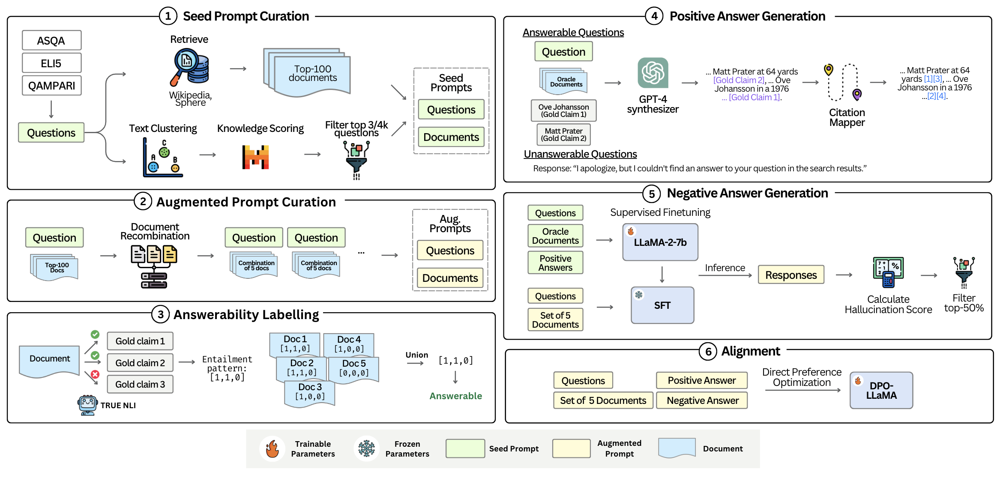

# Measuring and Enhancing Trustworthiness of LLMs in RAG through Grounded Attributions and Learning to Refuse

> 📣 We are releasing Trust-Score, a holistic evaluation of
the trustworthiness of LLMs in a RAG framework, and the Trust-Align framework that aligns LLMs for higher Trust-Score. 
[Paper](https://arxiv.org/abs/2409.11242)

We are excited to announce the release of Trust-Score evaluation datasets and Trust-Align alignment datasets:

1) **[Trust-Score](https://huggingface.co/datasets/declare-lab/Trust-Score/tree/main/Trust-Score)**: It features calibrated questions and refusals to measure the model's trustworthiness.

2) **[Trust-Align](https://huggingface.co/datasets/declare-lab/Trust-Score/tree/main/Trust-Align)**: Enhance the model's trustworthiness with high-quality synthesized cited responses.


## Overview

LLMs are an integral part of retrieval-augmented generation (RAG) systems. While many studies focus on evaluating the quality of end-to-end RAG systems, there is a lack of research on understanding the appropriateness of an LLM for the RAG task. Thus, we introduce a new metric, Trust-Score, that provides a holistic evaluation of the trustworthiness of LLMs in an RAG framework. We show that various prompting methods, such as in-context learning, fail to adapt LLMs effectively to the RAG task. Thus, we propose Trust-Align, a framework to align LLMs for higher Trust-Score. LLaMA-3-8b, aligned with our method, significantly outperforms open-source LLMs of comparable sizes on ASQA (↑10.7), QAMPARI (↑29.2), and ELI5 (↑14.9). 

## Quick Links

  - [Requirements](#requirements)
  - [Data](#data)
  - [Trust-Score](#trust-score)
  - [Trust-Align](#trust-align)
  - [Training](#training)
  - [Bug or Questions](#bug-or-questions)
  - [Citation](#citation)


## Requirements

```bash
conda env create -f environment.yml
conda activate cite
pip install -r requirements.txt
```
We use the latest version of `alignment-handbook` for training (ver `alignment-handbook-0.4.0.dev0`). We followwed the installation instructions on [alignment-handbook repository](https://github.com/huggingface/alignment-handbook):

```bash
git clone https://github.com/huggingface/alignment-handbook.git
cd ./alignment-handbook/
python -m pip install .
```

<!-- ## Code Structure

* `data_processing/`: TRUST_Align preference data generation pipeline
* `heuristic_preference`: alignment response generation.
* `run.py`: run file to reproduce our baseline generations.
* `eval.py`: eval file to evaluate generations.
* `prompts`: folder that contains all prompt files.
* `configs/`: folder that contains all config files to reproduce baselines.
* `tools/`: misc code (generate summaries/snippets, reranking, etc.) -->

## Data

Trust-Score evaluation dataset is available on [Huggingface](https://huggingface.co/datasets/declare-lab/Trust-Score/tree/main/Trust-Score).

Trust-Align training dataset is also available [Huggingface](https://huggingface.co/datasets/declare-lab/Trust-Score/tree/main/Trust-Align).

## Trust-Score

**Trust-Score** is a more reliable and comprehensive measure of an LLM's capabilities for RAG, covering the following aspects: Does the LLM correctly identify answerable questions? Are the responses grounded in the provided documents, i.e., do the citations support the claims in the ground-truth response? And are the citations relevant?


### Eval Data Preparation

We support three types of dataset format: EM (Exact Match, like ASQA type), EM@5 (top-5 EM, like QAMPARI type), or CM (Claim Match, like ELI5 type).

Your evaluation dataset should satisfy the following format:

The file contains a list of JSON dictionaries with the following fields:

- `question` - The question being asked.
  
  Example:
  ```json
  "question": "Who has the highest goals in world football?"
  ```

- `answers`- A list of all gold answers, where each element is an array containing different variations of each gold answer. The gold answers can either be in short form or full sentences.
  
  Examples: 
  ```json
  "answers": [
    ["Daei", "Ali Daei"],
    ["Bican", "Josef Bican"],
    ["Sinclair", "Christine Sinclair"]
  ]
  ```
  or 

  ```json
  "answers": [
    [
        "Firms like Snapchat and Uber need to establish their brand and amass users before introducing ads."
    ],
    [
        "Introducing ads too early can deter potential users."
    ],
    [
        "Uber is reinvesting a lot of money to make their service better."
    ]
  ]
  ```


- `docs` - A list of dictionaries providing evidence from documents related to the question. Each dictionary contains the following fields:
  
  - `title` - The title of the document. 
  
  Example: 
  ``` json
  "title": "Argentina–Brazil football rivalry"
  ```
  
  - `text` - A snippet from the document containing relevant information. 
  
  Example: 
  ```json
  "text": "Pelé's 1281 goals are recognized by FIFA as the highest total achieved by a professional footballer, although the Soccer Statistic Foundation (rssf) recognizes only 767 goals in official mode, occupying the third place after Josef Bican (805) and Romario (772)."
  ```
  
  - `answers_found` - A list of integers, where each element corresponds to whether the answer was found in the document (0 if not found, 1 if found).

  Example:
  ``` json
  "answers_found": [
      0,
      0,
      0
  ]
  ```
  
  - `rec_score` - A recall score indicating the percentage of answers entailed by the document.
  
  Example:

  ``` json
  "rec_score": 0.0
  ```

### Evaluation Pipeline

You can easily evaluate your model based on the formatted evaluation dataset by running the following code:

``` python
from utils import RUN_Config
from trust_eval import TRUST_SCORE

config = RUN_Config()

# Assume you load this from a JSON or YAML file
example_config = {
  "prompt_file": "prompts/asqa_rejection.json",
  "eval_file": "data/asqa_eval_top100_calibrated.json",
  "output_dir": "save",
  "eval_type": "em",
  "model": "meta-llama/Llama-2-7b-chat-hf",
  "max_length": 4096,
  "temperature": 0.5,
  "top_p": 0.95,
  "vllm": True,
  "no_demo": True,
}

# Update config with new values
config.update_from_dict(example_config)

score = TRUST_SCORE(config)

print(score)
```


## Trust-Align



### Preparation

Please first refer to [Retrieval](https://github.com/princeton-nlp/ALCE/tree/main?tab=readme-ov-file#retrieval) in the ALCE benchmark to download the required document corpus (GTR-based Wikipedia snapshot and BM25-based Sphere)

Download the ASQA, QAMPARI, ELI5, and ExpertQA datasets accordingly.

### Seed Sample Curation

You can reproduce the seed sample curation step with the following command:

```bash
cd TRUST_ALIGN/seed_samples
sh cluster.sh
sh re_cali.sh
```
In `re_cali.sh`, remember to specify `BM25_SPHERE_PATH`, `DPR_WIKI_TSV`, and `GTR_EMB` to the paths where you stored each corpus, respectively.

Output is the `{dataset}_doc.json` in `data` folder.

The choice of `dataset` could be either `asqa`, `qampari`, `eli5`, or `expertqa`.

### Augment Sample Curation

You can reproduce the augment sample curation step (document recombination) with the following command:

```bash
cd TRUST_ALIGN/augment_samples
sh doc_recombination.sh {dataset}
```

Output is the `{dataset}_doc_augment.json` format in `data\` folder.


### Positive Response Generation

You can create natural responses by running the following code:

``` bash
cd TRUST_ALIGN/positives_synthesis
sh gen_ans.sh
```

In `gen_ans.sh`, please specify the `--data_file` with the path to your dataset.

To get positive responses with citations, run the following code:

``` bash
python gen_positives --input_folder {dataset_folder}
```

`{dataset_folder}` is the path to your saved datasets folder.


### Negative Response Selection

You first need to obtain the model's output for curated samples as follows:

``` bash
cd TRUST_ALIGN/negatives_selection
sh infer.sh
```

In `infer.sh`, you need to specify `INFER_FILE` and `OUTPUT_DIR` to the path you saved samples and the path you want to save the obtained output, respectively. You can also change the `--config` inside for other datasets.

Based on obtained model's output, you can calculate $e_i$ for each sample. Outputs the $e_i$ for each ith hallucination type in `.json` format stored in `data/` folder.

```bash
sh error_selection.sh 
```

In `error_selection.sh`, you also need to specify `BASE_DIR` and `OUTPUT_DIR` to the path you saved samples and the path you want to save the obtained output, respectively.


## Training

Our training code is based on the [alignment-handbook repository](https://github.com/huggingface/alignment-handbook). We provide the complete training code and configuration files for both SFT and DPO. To get started, you'll need to customize the `model_name_or_path` and `output_dir` settings, and adjust the `num_processes` and `per_device_train_batch_size` parameters in the `.yaml` configuration files according to your computational environment. For specifying the training dataset, use `dataset_mixer` to point to your dataset, ensuring it is in the [Hugging Face dataset format](https://huggingface.co/docs/datasets/en/create_dataset).

* SFT Training:
``` sh
cd training
sh sft.sh
```

* DPO Training:
``` sh
cd training
sh dpo.sh
```


## Bug or Questions?

If you have any questions related to the code or the paper, feel free to email Maojia (`maojia_song@mymail.sutd.edu.sg`). If you encounter any problems when using the code, or want to report a bug, you can open an issue. Please try to specify the problem with details so we can help you better and quicker!


## Citation

Please cite our paper if you use Trust-align in your work:

```bibtex
@misc{song2024measuringenhancingtrustworthinessllms,
      title={Measuring and Enhancing Trustworthiness of LLMs in RAG through Grounded Attributions and Learning to Refuse}, 
      author={Maojia Song and Shang Hong Sim and Rishabh Bhardwaj and Hai Leong Chieu and Navonil Majumder and Soujanya Poria},
      year={2024},
      eprint={2409.11242},
      archivePrefix={arXiv},
      primaryClass={cs.CL},
      url={https://arxiv.org/abs/2409.11242}, 
}
```
