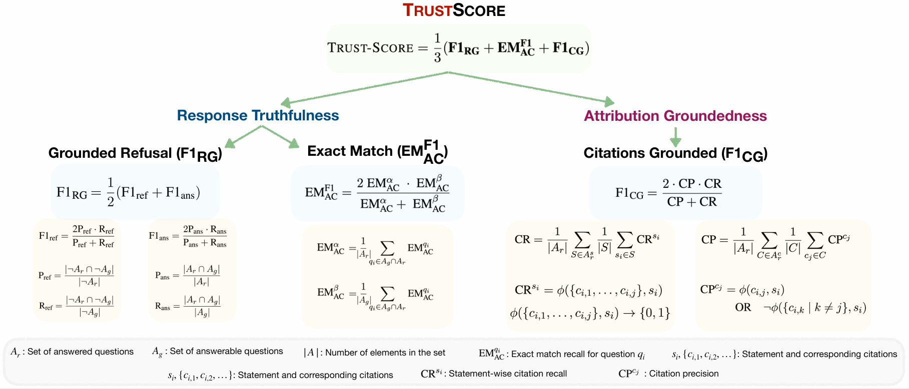

# Measuring and Enhancing Trustworthiness of LLMs in RAG through Grounded Attributions and Learning to Refuse

This repository contains the original implementation of [Measuring and Enhancing Trustworthiness of LLMs in RAG through Grounded Attributions and Learning to Refuse](https://arxiv.org/abs/2409.11242) (accepted at ICLR 2025). There are two parts to this repository:

1. Trust-Score: A holistic metric to evaluate the trustworthiness of inline-cited outputs generated by large language models (LLMs) within the Retrieval-Augmented Generation (RAG) framework

2. Trust-Align: A preference dataset and framework that aligns LLMs to be more trustworthy, as measured by higher Trust-Score.

**Paper abstract:**

LLMs are an integral part of retrieval-augmented generation (RAG) systems. While many studies focus on evaluating the quality of end-to-end RAG systems, there is a lack of research on understanding the appropriateness of an LLM for the RAG task. Thus, we introduce a new metric, Trust-Score, that provides a holistic evaluation of the trustworthiness of LLMs in an RAG framework. We show that various prompting methods, such as in-context learning, fail to adapt LLMs effectively to the RAG task. Thus, we propose Trust-Align, a framework to align LLMs for higher Trust-Score. LLaMA-3-8b, aligned with our method, significantly outperforms open-source LLMs of comparable sizes on ASQA (↑10.7), QAMPARI (↑29.2), and ELI5 (↑14.9).

## Set up

```bash
conda env create -f environment.yml
conda activate cite
pip install -r requirements.txt
```

We use the latest version of `alignment-handbook` for training (ver `alignment-handbook-0.4.0.dev0`). We followwed the installation instructions on [alignment-handbook repository](https://github.com/huggingface/alignment-handbook):

```bash
git clone https://github.com/huggingface/alignment-handbook.git
cd ./alignment-handbook/
python -m pip install .
```

<!-- ## Code Structure

* `data_processing/`: TRUST_Align preference data generation pipeline
* `heuristic_preference`: alignment response generation.
* `run.py`: run file to reproduce our baseline generations.
* `eval.py`: eval file to evaluate generations.
* `prompts`: folder that contains all prompt files.
* `configs/`: folder that contains all config files to reproduce baselines.
* `tools/`: misc code (generate summaries/snippets, reranking, etc.) -->

## Data

The **evaluation** dataset used in Trust-Score is available on [Huggingface](https://huggingface.co/datasets/declare-lab/Trust-Score/tree/main/Trust-Score).

The **SFT and DPO training** dataset used in Trust-Align is also available [Huggingface](https://huggingface.co/datasets/declare-lab/Trust-Score/tree/main/Trust-Align).

## Trust-Score

Trust-Score is a metric that comprehensively evaluates LLM trustworthiness on three main axes:

1. **Response Correctness**: Correctness of the generated claims
2. **Attribution Quality**: Quality of citations generated. Concerns the recall (Are generated statements well-supported by the set citations?) and precision (Are the citations relevant to the statements?) of citations.
3. **Refusal Groundedness**: Ability of the model to discern if the question can be answered given the documents



### Eval Data Preparation

We support three types of dataset format: EM (Exact Match, like ASQA type), EM@5 (top-5 EM, like QAMPARI type), or CM (Claim Match, like ELI5 type).

Here is a quick overview of how each of the three datasets look like:

**ASQA**

```javascript
[ ...
    {   // The question asked.
        "question": "Who has the highest goals in world football?",

        // A list containing all correct (short) answers to the question, represented as arrays where each element contains variations of the answer. 
        "answers": [
            ["Daei", "Ali Daei"],                // Variations for Ali Daei
            ["Bican", "Josef Bican"],            // Variations for Josef Bican
            ["Sinclair", "Christine Sinclair"]   // Variations for Christine Sinclair
        ],

        // A list of 100 dictionaries where each dictionary contains one document.
        "docs": [
            {   
                // The title of the document being referenced.
                "title": "Argentina\u2013Brazil football rivalry",

                // A snippet of text from the document.
                "text": "\"Football Player of the Century\", ...",

                // A binary list where each element indicates if the respective answer was found in the document (1 for found, 0 for not found).
                "answers_found": [0,0,0],

                // A recall score calculated as the percentage of correct answers that the document entails.
                "rec_score": 0.0
            },
        ]
    },
...
]
```

**QAMPARI**

```javascript
[ ...
  // A list of dictionaries where each dictionary contains the information for one sample
  {
    // The question asked.
    "question": "What manga was drawn by Ryoichi Ikegami?",

    // A list containing all correct (short) answers to the question, represented as arrays where each element contains variations of the answer.
    "answers": [["Heat"],["Mai, the Psychic Girl"],["Wounded Man"],["Sanctuary"],["Crying Freeman"],["Strain"]],
    
    // A list of 100 dictionaries where each dictionary contains one document.
    "docs": [
        {
          // The title of the document being referenced.
            "title": "Ryu Fujisaki",
            
            // A snippet of text from the document.
            "text": "Ryu Fujisaki He won prizes in 39th and the 40th Tezuka Awards. He made his professional ...",

            // A binary list where each element indicates if the respective answer was found in the document (1 for found, 0 for not found).
            "answers_found": [0,0,0,0,0,0],
            
            // A recall score calculated as the percentage of correct answers that the document entails.
            "rec_score": 0.0
        },
        ...
    ]
  }
  ...
]
```

**ELI5**

```javascript
[...
  // A list of dictionaries where each dictionary contains the information for one sample
  {
    // The question asked.
    "question": "How are firms like snapchat, uber etc valued so highly while still not making a profit? ...",

    // A list containing all correct answers to the question. Generated using text-davinci-003 to break gold long form answer into three claims.
    "answers": [
        ["Firms like Snapchat and Uber need to establish their brand and amass users before introducing ads."],
        ["Introducing ads too early can deter potential users."],
        ["Uber is reinvesting a lot of money to make their service better."]
    ],

    // A list of 100 dictionaries where each dictionary contains one document.
    "docs": [
        {
          // The title of the document being referenced.
            "title": "Is Snapchat really worth $19 billion? - CSMonitor.com",

            // A snippet of text from the document.
            "text": "reporting that the Los Angeles-based company is ...",

            // A binary list where each element indicates if the respective answer was found in the document (1 for found, 0 for not found).
            "answers_found": [0,0,0],

            // A recall score calculated as the percentage of correct answers that the document entails.
            "rec_score": 0.0
        },
        ...
    ]
  }
  ...
]
```

### Evaluation Pipeline

You can easily evaluate your model using the evaluation dataset by running the following code:

``` python
from utils import RUN_Config
from trust_eval import TRUST_SCORE

config = RUN_Config()

# Assume you load this from a JSON or YAML file
example_config = {
  "prompt_file": "prompts/asqa_rejection.json",
  "eval_file": "data/asqa_eval_top100_calibrated.json",
  "output_dir": "save",
  "eval_type": "em",
  "model": "meta-llama/Llama-2-7b-chat-hf",
  "max_length": 4096,
  "temperature": 0.5,
  "top_p": 0.95,
  "vllm": True,
  "no_demo": True,
}

# Update config with new values
config.update_from_dict(example_config)

score = TRUST_SCORE(config)

print(score)
```

### Baselines

To run PostCite and PostAttr baselines, please run the following commands:

```bash
bash post_hoc_cite.sh
```

To adjust for various settings, change `RETREIVER`, `MODEL` and `MAX_LEN` in `post_hoc_cite.sh` accordingly.

## Trust-Align


### Preparation

Please first refer to [Retrieval](https://github.com/princeton-nlp/ALCE/tree/main?tab=readme-ov-file#retrieval) in the ALCE benchmark to download the required document corpus (GTR-based Wikipedia snapshot and BM25-based Sphere)

Download the ASQA, QAMPARI, ELI5, and ExpertQA datasets accordingly.

### Seed Sample Curation

You can reproduce the seed sample curation step with the following command:

```bash
cd TRUST_ALIGN/seed_samples
sh cluster.sh
sh re_cali.sh
```

In `re_cali.sh`, remember to specify `BM25_SPHERE_PATH`, `DPR_WIKI_TSV`, and `GTR_EMB` to the paths where you stored each corpus, respectively.

Output is the `{dataset}_doc.json` in `data` folder.

The choice of `dataset` could be either `asqa`, `qampari`, `eli5`, or `expertqa`.

### Augment Sample Curation

You can reproduce the augment sample curation step (document recombination) with the following command:

```bash
cd TRUST_ALIGN/augment_samples
sh doc_recombination.sh {dataset}
```

Output is the `{dataset}_doc_augment.json` format in `data\` folder.

### Positive Response Generation

You can create natural responses by running the following code:

``` bash
cd TRUST_ALIGN/positives_synthesis
sh gen_ans.sh
```

In `gen_ans.sh`, please specify the `--data_file` with the path to your dataset.

To get positive responses with citations, run the following code:

``` bash
python gen_positives --input_folder {dataset_folder}
```

`{dataset_folder}` is the path to your saved datasets folder.

### Negative Response Selection

You first need to obtain the model's output for curated samples as follows:

``` bash
cd TRUST_ALIGN/negatives_selection
sh infer.sh
```

In `infer.sh`, you need to specify `INFER_FILE` and `OUTPUT_DIR` to the path you saved samples and the path you want to save the obtained output, respectively. You can also change the `--config` inside for other datasets.

Based on obtained model's output, you can calculate $e_i$ for each sample. Outputs the $e_i$ for each ith hallucination type in `.json` format stored in `data/` folder.

```bash
sh error_selection.sh 
```

In `error_selection.sh`, you also need to specify `BASE_DIR` and `OUTPUT_DIR` to the path you saved samples and the path you want to save the obtained output, respectively.

## Training

Our training code is based on the [alignment-handbook repository](https://github.com/huggingface/alignment-handbook). We provide the complete training code and configuration files for both SFT and DPO. To get started, you'll need to customize the `model_name_or_path` and `output_dir` settings, and adjust the `num_processes` and `per_device_train_batch_size` parameters in the `.yaml` configuration files according to your computational environment. For specifying the training dataset, use `dataset_mixer` to point to your dataset, ensuring it is in the [Hugging Face dataset format](https://huggingface.co/docs/datasets/en/create_dataset).

- SFT Training:

``` sh
cd training
sh sft.sh
```

- DPO Training:

``` sh
cd training
sh dpo.sh
```

## Bug or Questions?

If you have any questions related to the code or the paper, feel free to email Maojia (`maojia_song@mymail.sutd.edu.sg`). If you encounter any problems when using the code, or want to report a bug, you can open an issue. Please try to specify the problem with details so we can help you better and quicker!

## Citation

If you find our code, data, models, or the paper useful, please cite the paper:

```bibtex
@misc{song2024measuringenhancingtrustworthinessllms,
      title={Measuring and Enhancing Trustworthiness of LLMs in RAG through Grounded Attributions and Learning to Refuse}, 
      author={Maojia Song and Shang Hong Sim and Rishabh Bhardwaj and Hai Leong Chieu and Navonil Majumder and Soujanya Poria},
      year={2024},
      eprint={2409.11242},
      archivePrefix={arXiv},
      primaryClass={cs.CL},
      url={https://arxiv.org/abs/2409.11242}, 
}
```
