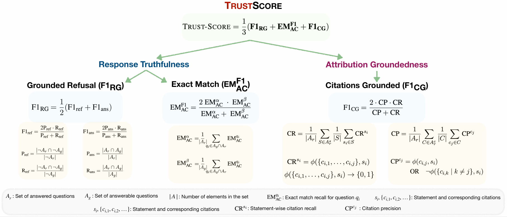

# List of available metrics



Trust-Score is a metric that comprehensively evaluates LLM trustworthiness on three main axes:

1) **Response Correctness**: Correctness of the generated claims
2) **Attribution Quality**: Quality of citations generated. Concerns the recall (Are generated statements well-supported by the set citations?) and precision (Are the citations relevant to the statements?) of citations.
3) **Refusal Groundedness**: Ability of the model to discern if the question can be answered given the documents

Sample output:

```javascript
{   // refusal response: "I apologize, but I couldn't find an answer..."
    
    // basic statistics
    "answered_ratio": 50.0, // Ratio of (# answered qns / total # qns)
    "answered_num": 5, // # of qns where response is not refusal response
    "answerable_num": 7, // # of qns that ground truth answerable, given the documents
    "overlapped_num": 5, // # of qns that are both answered and answerable
    "regular_length": 46.6, // Average length of all responses
    "answered_length": 28.0, // Average length of non-refusal responses

    // Refusal groundedness metrics
    
    // # qns where (model refused to respond & is ground truth unanswerable) / # qns is ground truth unanswerable
    "reject_rec": 100.0, 

    // # qns where (model refused to respond & is ground truth unanswerable) / # qns where model refused to respond
    "reject_prec": 60.0,

    // F1 of reject_rec and reject_prec
    "reject_f1": 75.0,

    // # qns where (model respond & is ground truth answerable) / # qns is ground truth answerable
    "answerable_rec": 71.42857142857143,

    // # qns where (model respond & is ground truth answerable) / # qns where model responded
    "answerable_prec": 100.0,

    // F1 of answerable_rec and answerable_prec
    "answerable_f1": 83.33333333333333,

    // Avg of reject_rec and answerable_rec
    "macro_avg": 85.71428571428572,

    // Avg of reject_f1 and answerable_f1
    "macro_f1": 79.16666666666666,

    // Response correctness metrics

    // Regardless of response type (refusal or answered), check if ground truth claim is in the reponse. 
    "regular_str_em": 41.666666666666664,

    // prop of qns where model provided responses that covered all ground truth claims
    "regular_str_hit": 20.0,

    // Only for qns with answered responses, check if ground truth claim is in the reponse. 
    "answered_str_em": 66.66666666666666,
    
    // Prop of answered qns where model provided responses that covered all ground truth claims
    "answered_str_hit": 40.0,

    // Calculate EM for all qns that are answered and answerable, avg by # of answered questions
    "calib_answered_str_em": 100.0,

    // prop of answered qns where model responded to qns that are answerable and response covered all ground truth claims
    "calib_answered_str_hit": 100.0,

    // Calculate EM for all qns that are answered and answerable, avg by # of answered questions (EM_alpha)
    "calib_answerable_str_em": 71.42857142857143,

    // prop of answerable qns where model responded to qns that are answerable and response covered all ground truth claims (EM_beta)
    "calib_answerable_str_hit": 71.42857142857143,

    // F1 of calib_answered_str_em and calib_answerable_str_em
    "calib_str_em_f1": 83.33333333333333,

    // EM score of qns that are answered and ground truth unanswerable, indicating use of parametric knowledge
    "parametric_str_em": 0.0,

    // prop of qns that are answered and ground truth unanswerable that response covered all ground truth claims 
    "parametric_str_hit": 0.0,

    // Cittaion quality metrics

    // (Avg across all qns) Does the set of citations support statement si? 
    "regular_citation_rec": 28.333333333333332,

    // (Avg across all qns) Any redundant citations? (1) Does citation ci,j fully support statement si? (2) Is the set of citations without ci,j insufficient to support statement si? 
    "regular_citation_prec": 35.0,

    // F1 of regular_citation_rec and regular_citation_prec
    "regular_citation_f1": 31.315789473684212,

    // (Avg across answered qns)
    "answered_citation_rec": 50.0,

    // (Avg across answered qns)
    "answered_citation_prec": 60.0,

    // F1 answered_citation_rec and answered_citation_prec
    "answered_citation_f1": 54.54545454545455,

    // Avg (macro_f1, calib_str_em_f1, answered_citation_f1)
    "trust_score": 72.34848484848486
}
```
