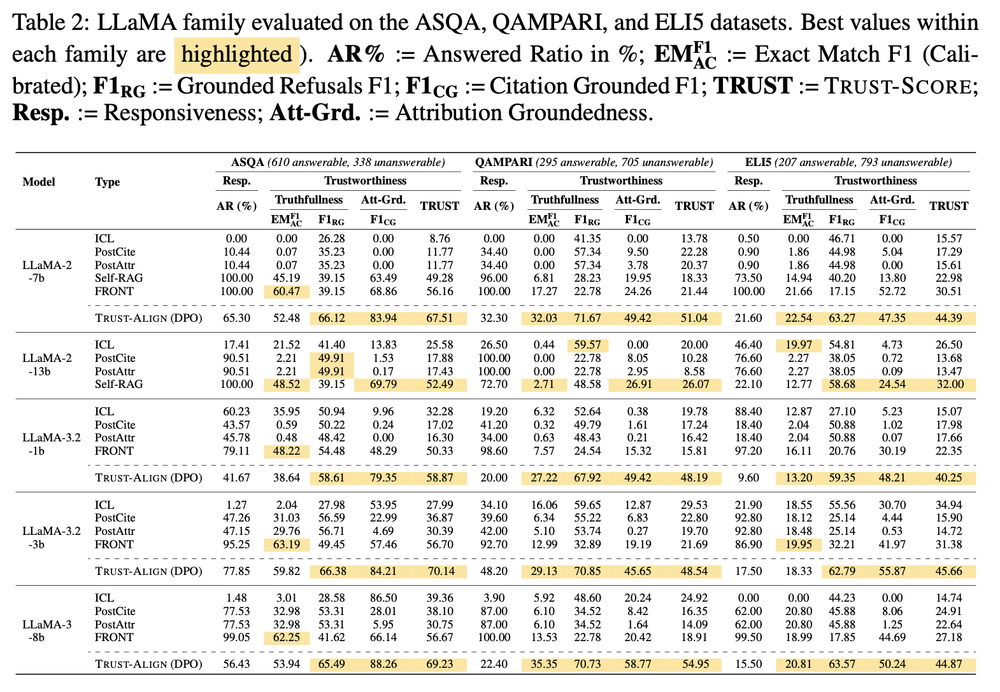

# Experimental Setup

*Table 2 from the paper*


To reproduce the experiments from our paper, please refer to the `yaml` files stored in `./configs`.

```text
experiments/
├── configs/ # stores the configs used for the various experiments
├── data/ # put downloaded data from HF
├── eval_data/ # output will store here after response generation, evaluation will use this
├── results/ # store the files containing scores
├── prompts/
```

Please run the main script with the following command:

```bash
CUDA_VISIBLE_DEVICES=0 python main.py
```

> Note: this codebase has been tested on 2 A40 (40GB) or 1 A100 (80GB).

Some additional notes:

- **ICL**: XXX_rejection_baseline.yaml
- **PostCite/PostAtrr**: XXX_closedbook_rejection_baseline.yaml
- PostCite: set posthoc_retriever = `gtr-t5-large`
- PostAttr: set posthoc_retriever = `nli`
- **Self-RAG**: Run inference using pretrained [Self-RAG models](https://selfrag.github.io/) and then evaluate
- **FRONT**: Train model using [FRONT](https://github.com/LuckyyySTA/Fine-grained-Attribution), run inference on it and then evaluate
- **Trust-Align**: XXX_rejection_trustalign.yaml

### 🚧 Notice: Code Under Maintenance 🚧

The feature of testing and evaluating with OpenAI is currently under maintenance. You may encounter issues with is you set the following to True:

```javascript
openai_api: True  # Whether to use OpenAI API, default = False
azure: True  # Whether to use Azure OpenAI API, default = False
```
